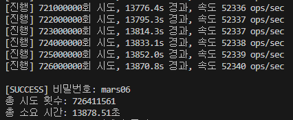

## Codyssey DMU 1주차 문제

### 필수 단계1: 이별은 화성, 잊고 있었던 고마운 것들 - 동양미래대 문제 내역

https://jakdalmak-work.notion.site/9-1f6f6bbbe13c8019ae03cfc9308b8b27?pvs=4

### 풀이자에게 전달 사항

- 과제 수행 목록 관련

```
- [x] emergency_storage_key.zip 의 암호를 풀 수 있는 코드를 작성한다.
      단 암호는 특수 문자없이 숫자와 소문자 알파벳으로 구성된 6자리 문자로 되어 있다.
- [x] 암호를 푸는 코드를 unlock_zip() 이라는 이름으로 함수로 만든다.
- [x] 암호를 푸는 과정을 출력하는데 시작 시간과 반복 회수 그리고 진행 시간등을
      출력한다.
- [x] 암호를 푸는데 성공하면 암호는 password.txt로 저장한다.
- [x] 암호를 풀 수 있는 전체 코드는 door_hacking.py로 저장한다.
```



- 문제 부가내역

  - Zip 파일 암호 : mars06
  - Zip 파일 내부 txt 내용 : B ehox Ftkl

- 추가과제 1 - 암호를 좀 더 빠르게 풀 수 있는 알고리즘을 제시하고 코드로 구현한다.
  - 구현 완료!

### 구현 내역 상세 설명

코드 내 주석으로 생략.

### 풀이 관련 내역

평가 미완료
